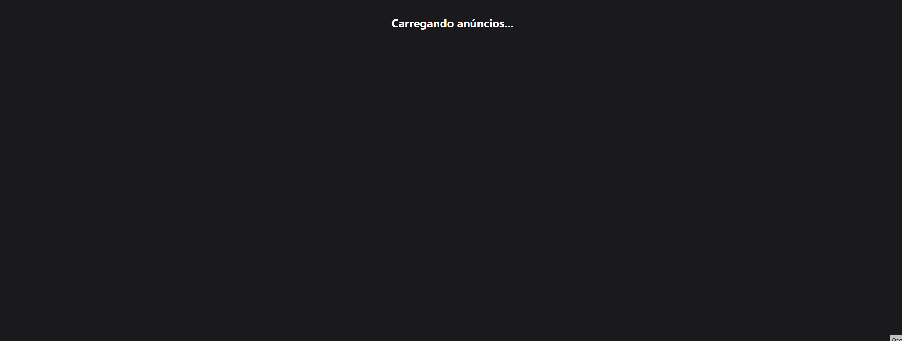

# Temporada Guarujá - Monitor de Aluguéis 🏖️




---

## 📜 Sobre o Projeto

O **Temporada Guarujá** é uma aplicação fullstack de engenharia de dados, criada para resolver um problema real: a dificuldade de encontrar aluguéis de temporada na cidade do Guarujá-SP durante períodos de alta demanda.

O projeto consiste em um pipeline de dados completo que realiza as seguintes tarefas:
1.  **Coleta (Web Scraping):** Um robô construído com Selenium acessa o portal `Temporada Livre`, extraindo informações de anúncios de imóveis.
2.  **Armazenamento:** Os dados coletados são salvos em um banco de dados PostgreSQL na nuvem (Supabase), garantindo persistência e escalabilidade.
3.  **Serviço (API):** Uma API em Flask consulta o banco de dados e serve os dados de forma estruturada.
4.  **Visualização (Dashboard):** Uma interface em React consome a API e exibe os anúncios em um dashboard interativo e amigável.

---

## 🏛️ Arquitetura do Sistema

O fluxo de dados do projeto segue a seguinte arquitetura:

`[Scraper (Selenium)]` → `[Banco de Dados (Supabase)]` → `[API (Flask)]` → `[Dashboard (React)]`

---

## 🛠️ Stack de Tecnologias

- **Coleta de Dados:**
  - Python
  - Selenium, BeautifulSoup4, Webdriver Manager
- **Banco de Dados:**
  - Supabase (PostgreSQL)
- **Backend:**
  - Flask, Flask-CORS
  - Supabase-py (cliente oficial)
  - Python-dotenv
- **Frontend:**
  - React.js
  - Axios
  - CSS
- **Ferramentas:**
  - Git & GitHub
  - Trello (para gerenciamento de projeto)

---

## 🚀 Como Executar o Projeto Localmente

Para rodar este projeto, você precisará ter o Python e o Node.js instalados em sua máquina, além de credenciais para o Supabase.

```bash
# 1. Clone o repositório
git clone [https://github.com/nathanmoreeira/temporada-guaruja-scraper.git](https://github.com/nathanmoreeira/temporada-guaruja-scraper.git)

# 2. Navegue até a pasta do projeto
cd temporada-guaruja-scraper
```

## Backend (Scraper + API)
Abra um terminal na pasta temporada-guaruja-scraper.

```bash
# 3. Crie e ative um ambiente virtual
python -m venv venv
# No Windows:
.\venv\Scripts\activate
# No Mac/Linux:
source venv/bin/activate

# 4. Instale as dependências a partir do arquivo
pip install -r requirements.txt

# 5. Crie e configure o arquivo .env com suas chaves do Supabase
# (Siga o modelo do arquivo .env.example)

# 6. Para rodar a API (ela rodará em http://localhost:8000)
python api/app.py

# 7. Para rodar o Scraper e popular o banco de dados
python scraper.py
```

## Frontend (Dashboard em React)
Abra um novo terminal na pasta temporada-guaruja-scraper.

```bash
# 8. Navegue até a pasta do frontend
cd frontend

# 9. Instale as dependências
npm install

# 10. Inicie a aplicação (ela rodará em http://localhost:3000)
npm start
